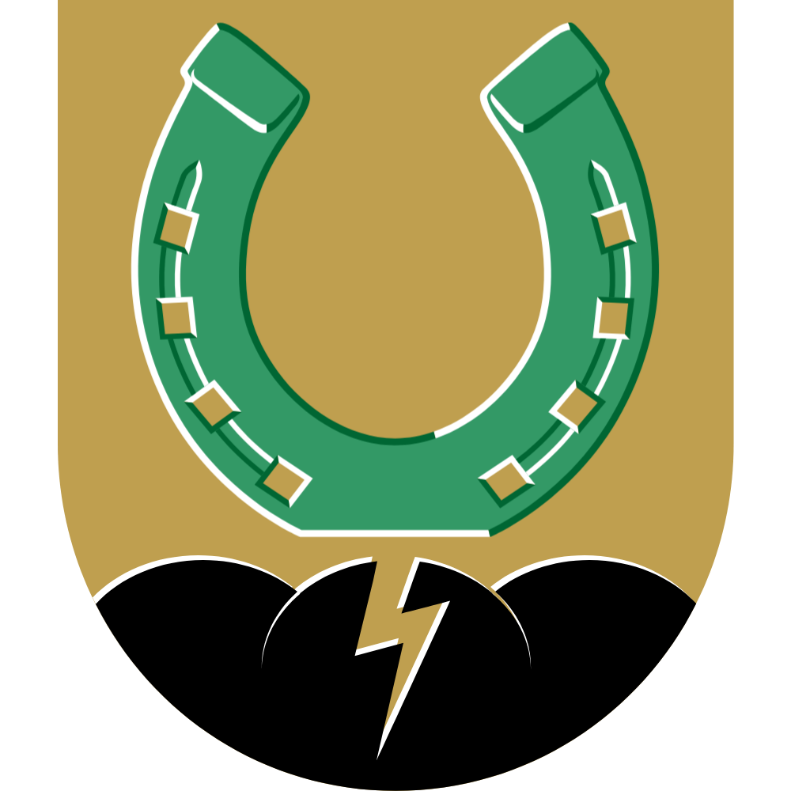

# Van Houten
Repository for all information and research concerning the ghost town of Van Houten (the coal mining village in Colfax, N.M.), and its culture.

---

## Overview
Van Houten, located in Colfax County, New Mexico, was once a thriving coal mining village established as the Willow Mining Camp in 1902. A true American melting pot, it was built by immigrants from diverse backgrounds, including Dutch, Germans, Austrians, Italians, Montenegrins, Greeks, and African Americans. The town was renamed in honor of Jan Van Houten (/jɑn vɑn ˈɦʌu̯.tən/ Yahn vahn HOW-ten), who revitalized the struggling camp and saved it from economic collapse.
Van Houten flourished until 1954, when the post-war decline in coal demand and the rise of alternative energy sources led to its abandonment. In the 1960s, most of the town’s structures were demolished due to changing tax codes. Today, the remnants of the tipple, mule barn, and a few standing houses serve as enduring reminders of the town’s rich history and cultural heritage.

---

## Contents
1. **Ephemera**
   - Relevant ephemera from the residents of Van Houten.

2. **Maps**
   - Updated .kml digital map file of all points of interest and regions.
   - Historical maps of the region and town.

3. **Photos**
   - All photos pertaining to Van Houten, both in mining and town life, from various sources.

4. **Publications**
   - Cultural publications regarding Van Houten.

5. **Tours**
   - Speaking notes from all known tour programs of Van Houten.

6. **Unexplored Charters**
   - Outlined memoranda for explorations for new discoveries and potential points of interest.

---

## Goals of the Repository
This repository aims to:
- Provide a centralized source of information about Van Houten, allowing for collaboration.
- Support future research of the town.
- Preserve the legacy and heritage of Van Houten, particularly among counselors of the NRA WC ADVC.

Contributions are welcome! If you have photographs, documents, or personal stories related to Van Houten, please consider sharing them here.

---

## How to Contribute
Contributions are welcome! To contribute:
1. Fork the repository.
2. Create a feature branch (git checkout -b feature-branch).
3. Commit changes (git commit -m 'Add feature').
4. Push to the branch (git push origin feature-branch).
5. Open a pull request.

---

## Future Work
- See TODO.md.

---

## License
- For licensing information, see LICENSE.

---

## Acknowledgments
Special thanks to historians, explorers, researchers, and community members who have contributed to preserving Van Houten’s history, including Tucker Barraclough, George 'Judo' Yaksich, Markus Aurelius Hecker, H. B. Nickelson, the employees of the NRA Whittington Center, and Kai Brennan.

---

  

